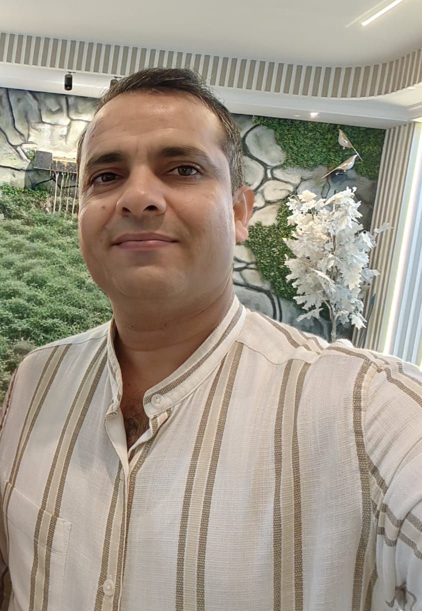
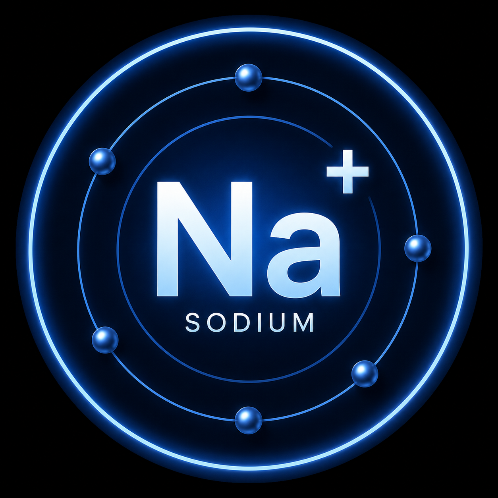
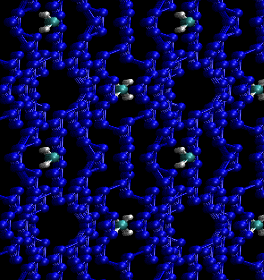
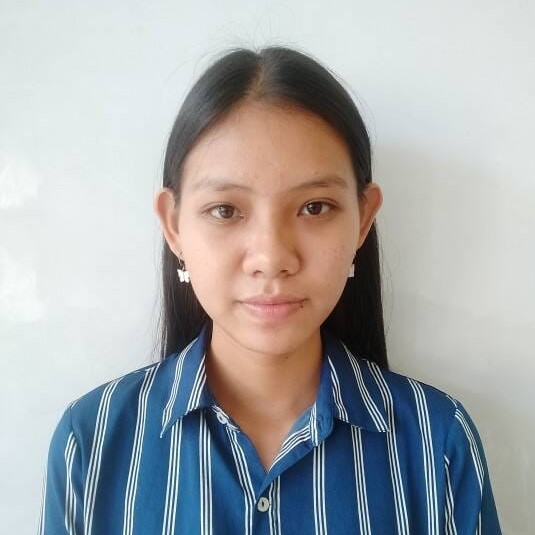

---

---

# Research Group

---

## Supervisor

<table>
<tr>
<td width="220" valign="top">

</td>

<td valign="top">

Dr. Mondal earned his B.Sc. in Chemistry from Raghunathpur College (University of Burdwan) in 2006, followed by an M.Sc. from the University of Pune, where he received the merit-based Scholarship (2007–2009) from NCL (National Chemical Laboratory, Pune) and qualified GATE and CSIR-UGC NET (JRF). He obtained his Ph.D. from IIT Kharagpur in 2015 under Prof. P. K. Chattaraj. Dr. Mondal completed a postdoctoral fellowship with Prof. G. Merino at CINVESTAV, Merida, moreover, earned the SNI Level-I fellowship from CONACYT (2016). He then returned to India as SERB National Postdoctoral Fellow (NPDF, 2017) at JNCASR, Bengaluru, to work with Prof. S. K. Pati. Currently, he is an Assistant Professor of Chemistry (Stage-II) at Assam University, Silchar. He has recently received Advanced Research Grant (ARG) from the Anusandhan National Research Foundation (ANRF), Govt. of India, and previously received the UGC-BSR Research Start-Up Grant of ₹10 Lakh from the UGC, Govt. of India. A Fellow and Life Member of the Indian Chemical Society (2019), Dr. Mondal has authored/co-authored research articles in top-tier journals (including J. Comp. Chem., J. Phys. Chem., Org. Lett., and Chem. Commun.), six book chapters, and serves as an editor for Frontiers in Chemistry and a reviewer for major international journals.

</td>
</tr>
</table>

---

## Students

### Kajal

<td width="220" valign="top">

</td>

**Position:** Project Associate-I  

**Research Area:** Unlocking high capacity of Sodium-Ion batteries.  

  

---

### Jasmeen

<td width="220" valign="top">

</td>

**Position:** Summer Intern  

**Research Area:** sI Methane Hydrates

---

### Anuradha

<td width="220" valign="top">

</td>

**Position:** Summer Intern  
**Research Area:** Molecular docking
**M.Sc.:** IIT Kharagpur and IACS Kolkata

---

[Back to Home](./)
