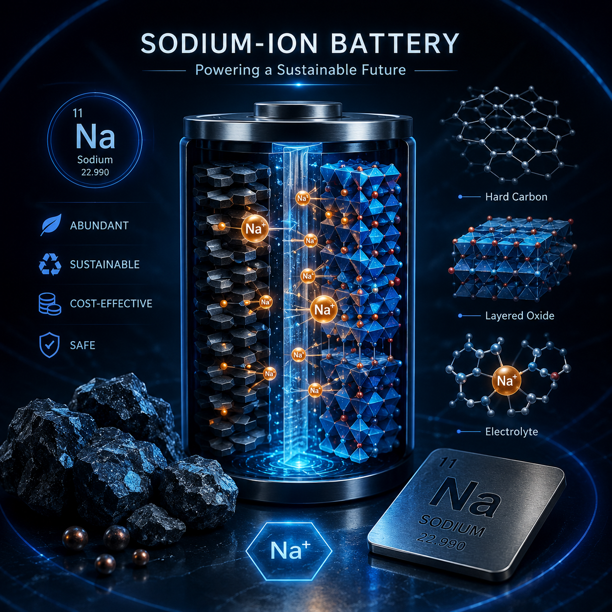
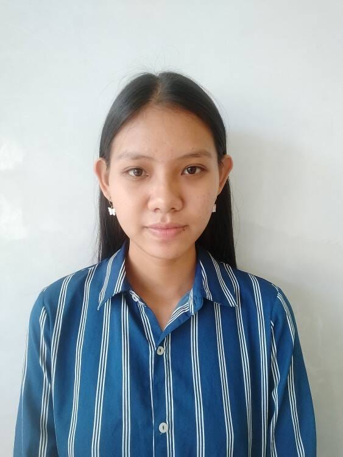

---

---

# Research Group

---

## Supervisor

<table>
<tr>
<td width="220" valign="top">

</td>

<td valign="top">

Dr. Sukanta Mondal

**Assistant Professor in Chemistry**  
A. M. School of Educational Sciences  
Assam University, Silchar, India

**Area of Specialization:**  
Physical Chemistry, Inorganic Chemistry

**Research Interests:**  
Hydrogen storage, Gas hydrates, Aromaticity, Metal Clusters, Nonclassical molecules and ions

**Email:**  
sukanta.mondal@aus.ac.in

</td>
</tr>
</table>

---

## Students

### Kajal Singh

<td width="220" valign="top">

</td>

**Position:** Project Associate-I  

**Research Area:** Unlocking high capacity of Sodium-Ion batteries.  

  

---

### Jasmeen Kaur

<td width="220" valign="top">

</td>

**Position:** Summer Intern  

**Research Area:** SNI Methane Clathrate  

---

### A Anuradha Singha 

<td width="220" valign="top">

</td>

**Position:** Summer Intern  

**M.Sc.:** IIT Kharagpur and IACS Kolkata

---

[Back to Home](./)
